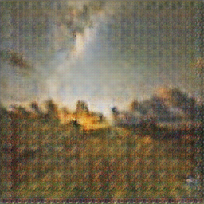

# Generative Adversarial Network (GAN) - Monet Painting Generation (CU Boulder MS-DS DTSA-5511)

## Overview
This notebook contains the code for the following Kaggle competition: Jang, A., Uzsoy, A. S., & Culliton, P. (2020). *I’m something of a painter myself*. Kaggle. https://kaggle.com/competitions/gan-getting-started.

## Goal
This project aims to build a GAN to generate 7'000 to 10'000 Monet-style images from pictures and submit the results.

## Data: size, structure, dimension

The data for this project consists of
- 300 Monet-style images (256x256) in JPEG and TFRecord format
- 7028 photos in JPEG and TFRecord format.

## Method: Generative Adversarial Networks (GANs)

Generative Adversarial Networks (GANs) are a deep learning framework designed to generate data from scratch, such as images, music, and beyond. GANs consist of two competing neural networks: the generator, which creates data, and the discriminator, which evaluates it for authenticity. Through an iterative process, these networks refine each other, with the generator aiming to produce data indistinguishable from real samples and the discriminator improving its ability to differentiate real from generated data. GANs have diverse applications, from creating realistic images (e.g., transforming photos into Monet-style paintings) to accelerating reinforcement learning. Despite their promise, challenges like vanishing gradients and ethical concerns about misuse accompany their immense potential.
